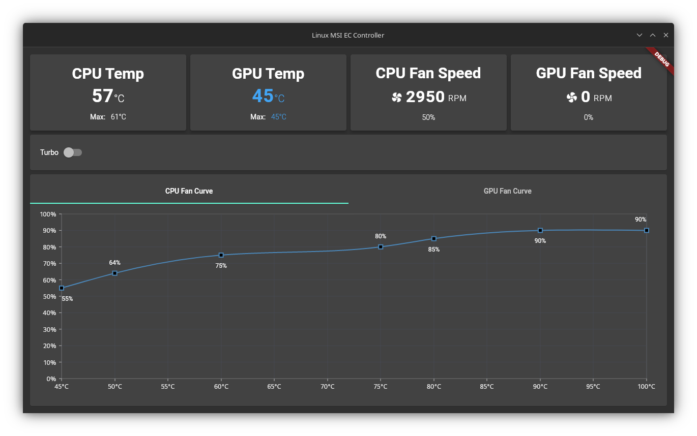
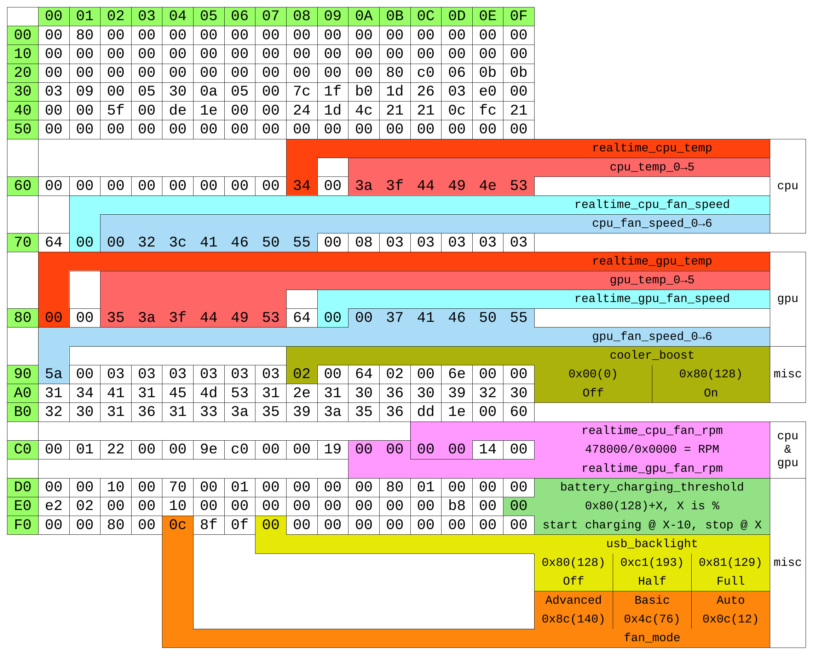

# Linux MSI EC Controller

This is a simple linux app intended to control some features of the MSI EC of some laptops



## Warning
- Write to the EC is dangerous, use it at your own risk!
- This program was made for personal use and to meet personal requirements, I have added some checks to prevent myself from doing something that could damage my laptop, but it is not a guarantee that this program is not going to damage your laptop
- I don't have any association with MSI, and I made this only with documentation that I found online

## Tested on laptops:
- [x] MSI GS65 Stealth 8SE

## Tested on distributions:
- [x] Fedora 37

## Dependencies
This project depends on [acpi_ec](https://github.com/musikid/acpi_ec) and must be run as root for now (Read the RoadMap for more details)

## Roadmap
- [x] Basic information about CPU and GPU temperatures and fan speeds
- [x] Control turbo bost
- [x] Display CPU Fan Curve
- [x] Display GPU Fan Curve
- [x] Change fan curve
- [ ] Creation and selection of profiles
- [ ] Elevation of privilegies only when necessary
  - I'm using this command for now but it has to be run every time the computer is restarted, also this could be dangerous as well:
  ```bash
  sudo chmod o+rw /dev/ec
  ```
- [ ] CLI utility

## About the EC

This is the diagram that I'm using to control the EC, make sure your EC works the same way, also thanks to [@YoyPa](https://github.com/YoyPa) as I found that diagram in his [isw](https://github.com/YoyPa/isw) project


